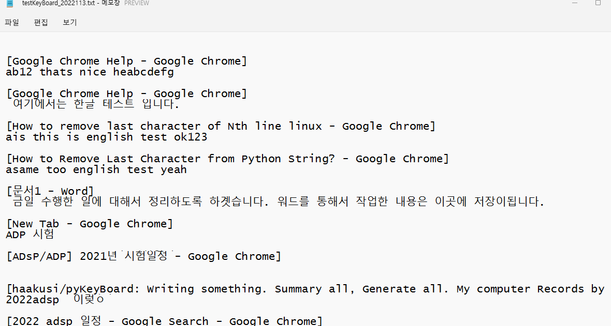
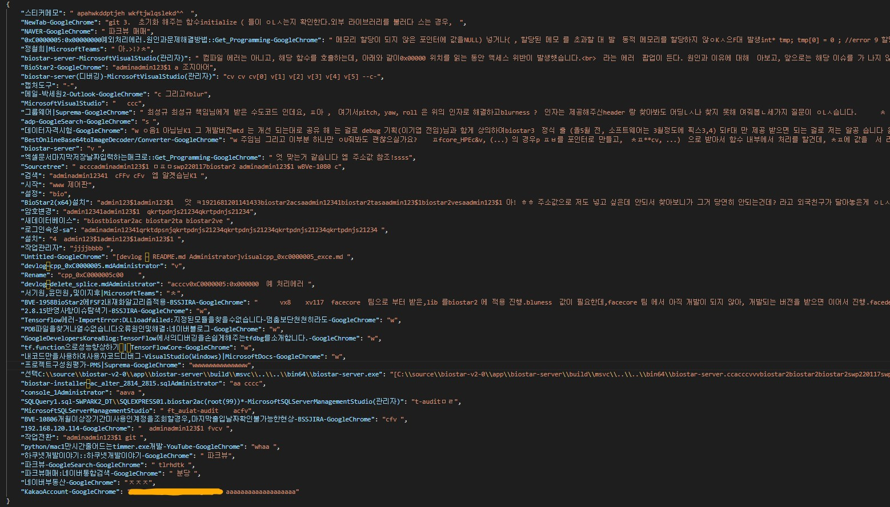

# pyKeyBoard
Writing something? Summary all! Generate something! 
'pyKeyBoard' will be Records your computer input values by Keyboard typing. 
 
 

    1. Start 'pyKeyBoard' process, writting all by keyboard input.
    2. Press pattern or button(if makes gui).
    3. Makes txt files, ex) pyKeyBoard_211229.txt 
    4. Makes json format. ex) { "process_title": "[input, intput, input...]", "process_title": "[input, intput, input...]" }
    5. Summary analysis to json, makes summary result files(ex. txt...)
       In this step, we can use to 'bart' models. it can be more efficenty others.. <-- *need to check other models and compare
    6. Finds 'KeyWords' in summaries and Makes sentences to use 'GPT' models.
    
 

### Dev Story

22.01.18 - *[Edit] README.md, *[Edit] main.py

    noti)
    - modify json format and clearly get to process title name. 
    - so next time, need to thinking about how to use json format and adjust to 'bart' model.

    fixed)
    4. adjust special keys Shift, Ctrl.. key +@ : event type UP/DOWN to Check write only 1. -> not adjust. complicated and not important. special key - 22.01.18
    5. space, shift, ctrl.. at least space, backspace, enter to adjust code by unicode. adjust json format - 22.01.18
    7. next to makes .json format. english / korean checked.. maybe utf-8 > unicode? this time checking utf8/unicode in korean. to used.. modules.. lib... - 22.01.18

    add)
    14. preprocessing about incoreect words.. delete.
    15. thinking about how to use json format. learning bart model. and next step

22.01.17 - *[Modify] main.py 

    noti)
    - delete repeat codes -> makes functions()

    fixed)
    - 1. consider about : process unit.. get hanFlag..? thinking about more efficiency solutions....

22.01.13 - *[Modify] main.py 

    noti)
    - adjust backspace english, korean typing.

    fixed)
    - 10. backspace -> delete, pop[-1]

21.12.29 - *[Edit] README.md, *[Commit] main.py

    noti)
    - First commit in this project. maybe next times, bug fixed and dev somethings.

    fixed)
    - if i get to know about focus programs, i need to know about korean/english program status.. return

 
 

### Todo Dev List
    (clear) 1. consider about : process unit.. get hanFlag..? thinking about more efficiency solutions.... - 22.01.17
    2. eng/kor status logic. if make 1 sentence -> write() : more efficiency than now..
    <undder GUI> 3. json data structure.. to use 'bart' models
    (clear) 4. adjust special keys Shift, Ctrl.. key +@ : event type UP/DOWN to Check write only 1. -> not adjust. complicated and not important. special key - 22.01.18
    (clear) 5. space, shift, ctrl.. at least space, backspace, enter to adjust code by unicode. adjust json format - 22.01.18
    <undder GUI> 6. need to exit sequence... function (now key press 'f1')
    (clear) 7. next to makes .json format. english / korean checked.. maybe utf-8 > unicode? this time checking utf8/unicode in korean. to used.. modules.. lib... - 22.01.18
    <undder GUI> 8. interface. ~ing thread -> moving img..
    (clear) 9. if saved completely, key, val += string -> need to convert 'json' preprocessing.
    (clear) 10. backspace -> delete, pop[-1] - 22.01.13
    <undder GUI> 11. key press 3,1times 'f10','f11' likes 'f10f10f10f11' -> To read testKeyBoard_%s.txt -> It makes to obj json [{ "key" : "val" }, { "key" : "val" }, ...]
    <undder GUI> 12. key press 3,1times 'f11','f12' likes 'f11f11f11f12' -> obj json -> to use pretrained bert Model.. -> output
    <undder GUI> 13. after preprocessing, adjust to BART, BERT.. to use content summary model
    14. preprocessing about incoreect words.. delete.
    15. thinking about how to use json format. learning bart model. and next step 

    GUI(new) - 22.01.25
    1. make btn, UI.. stay top.. click.. abstract keyword.. summary.. generate.. all forms simple!
    2. add function start recording btn <-> stop recording btn
    3. add function save txt btn, make json file btn (differ on <-> off)
    4. add function abstract "top keyword" in progress bar
    5. add function next to 4, show about simple json summary today 
    6. summary(bart) json file
    7. generate to centents with "top keyword" by "ko-gpt"

    ### orinary consider about this 'pyKeyBoard' project.
      and then another function likes bert, lstm..
      analysis that means.. 
      likes this..
      what can i do something with program, text... logs..
      ** idea) to use BERT -> summary(), and next to extract keyword, it can use to 1~2 sentence generation. (likes GPT) -- so fun, enjoying.
      ** serious safety) login page id/pw need.. blocked version
 
 

### Sample fixed.22.01.13

### Sample json format.22.01.18

   

      

     